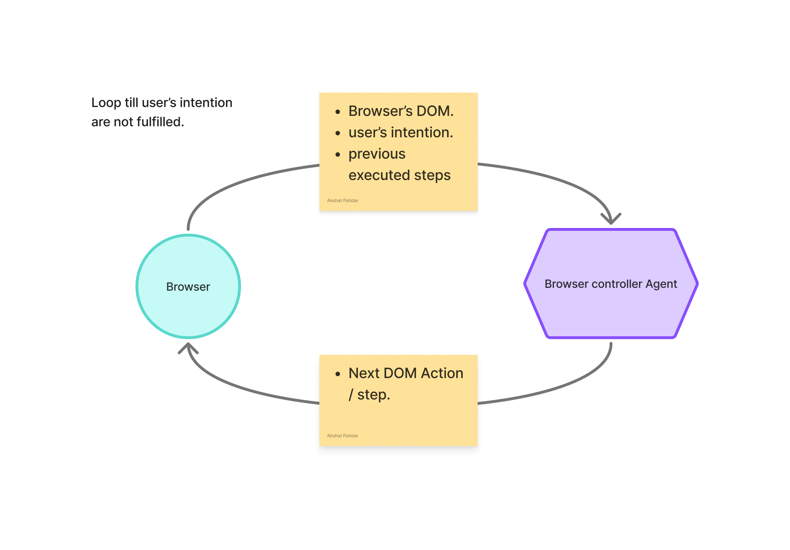

# Floating Frame Chrome Extension

A production-ready Chrome extension featuring a beautiful, draggable floating frame built with React and modern web technologies.

## Features

- **Draggable Interface**: Smooth drag-and-drop functionality with position memory
- **Expand/Collapse**: Toggle between minimized and expanded states
- **Shadow DOM Isolation**: Complete style isolation using closed shadow DOM
- **Material Design**: Modern, clean interface with glassmorphism effects
- **Responsive Design**: Adapts to different screen sizes and orientations
- **Performance Optimized**: Uses React.memo, debounced handlers, and efficient re-renders
- **Cross-browser Compatibility**: Works across modern browsers
- **Error Handling**: Robust error handling with graceful degradation

## Technical Stack

- **React 18** with TypeScript
- **Shadow DOM** for style isolation
- **Vite** for modern build tooling
- **Manifest V3** for Chrome extensions
- **Lucide React** for icons
- **CSS3** with advanced animations and transitions

## Architecture

- AI Architecture

- Browser Automation


## Installation

### Development Setup

1. Clone the repository:
```bash
git clone <repository-url>
cd floating-frame-extension
```

2. Install dependencies:
```bash
npm install
```

3. Build the extension:
```bash
npm run build:extension
```

4. Load the extension in Chrome:
   - Open Chrome and navigate to `chrome://extensions/`
   - Enable "Developer mode"
   - Click "Load unpacked" and select the `dist` folder

### Production Build

```bash
npm run build:extension
```

This creates a production-ready extension in the `dist` folder.

## Architecture

### File Structure

```
src/
├── content/
│   ├── FloatingFrame.tsx    # Main React component
│   ├── content.ts           # Content script injection logic
│   └── content.css          # Minimal host styles
public/
├── manifest.json            # Extension manifest
└── popup.html              # Extension popup
```

### Key Components

1. **FloatingFrame.tsx**: Main React component with drag functionality, state management, and UI
2. **content.ts**: Handles Shadow DOM creation, React mounting, and lifecycle management
3. **Shadow DOM**: Provides complete style isolation from host pages

### Performance Optimizations

- **React.memo**: Prevents unnecessary re-renders
- **Debounced handlers**: Optimizes drag and resize events
- **Lazy loading**: Defers non-critical component loading
- **Efficient state management**: Minimizes state updates

## Usage

Once installed, the floating frame will automatically appear on supported websites. Users can:

- **Drag**: Click and drag the header to reposition
- **Toggle**: Click the minimize/maximize button to expand/collapse
- **Close**: Click the X button to remove the frame
- **Responsive**: Frame adapts to screen size changes

## Browser Support

- Chrome 88+
- Edge 88+
- Opera 74+
- Brave (Chromium-based)

## Development

### Local Development

```bash
npm run dev
```

### Building

```bash
npm run build:extension
```

### Linting

```bash
npm run lint
```

## License

MIT License - see LICENSE file for details.

## Contributing

1. Fork the repository
2. Create a feature branch
3. Make your changes
4. Add tests if applicable
5. Submit a pull request

## Security

This extension uses:
- Closed Shadow DOM for complete isolation
- Minimal permissions (`activeTab`, `scripting`)
- CSP-compliant code
- No external API calls or data collection
